# User Flows
## Smart Community Ride Sharing Platform

---

## Driver Journey (End-to-End)

The driver journey covers registration through repeated, habitual ride publishing.

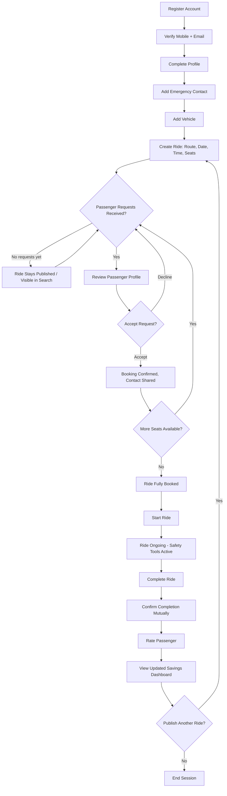

---

## Passenger Journey (End-to-End)

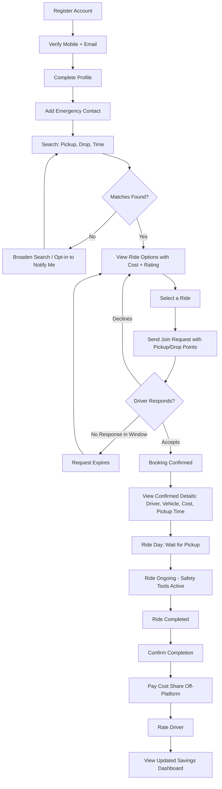

---

## First-Time User Journey

First-time users need extra guidance and trust-building before their first transaction.

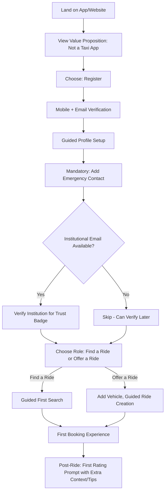

---

## Returning User Journey

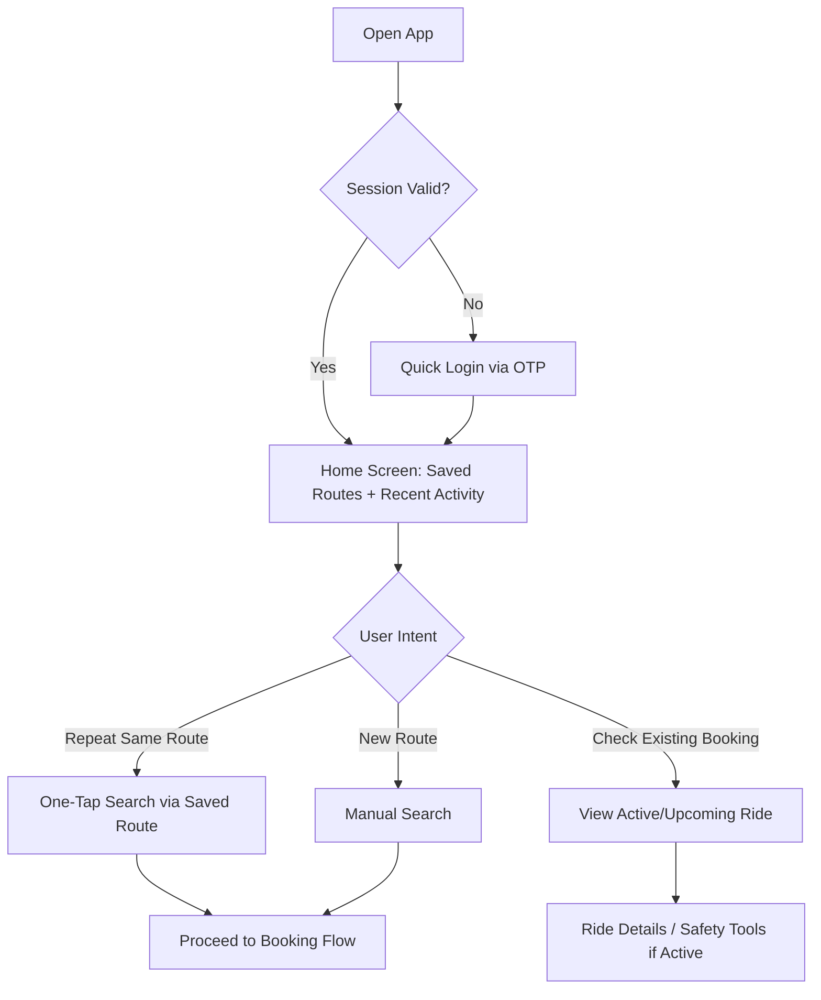

---

## Ride Creation Flow

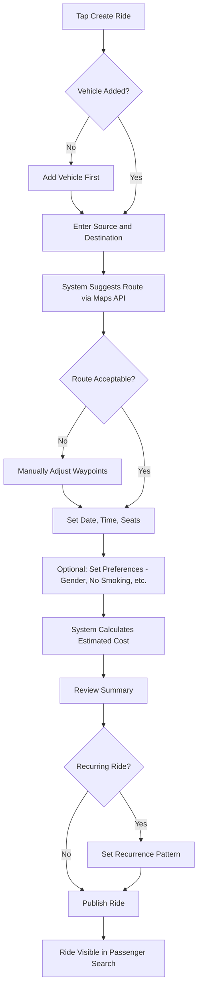

---

## Ride Search Flow

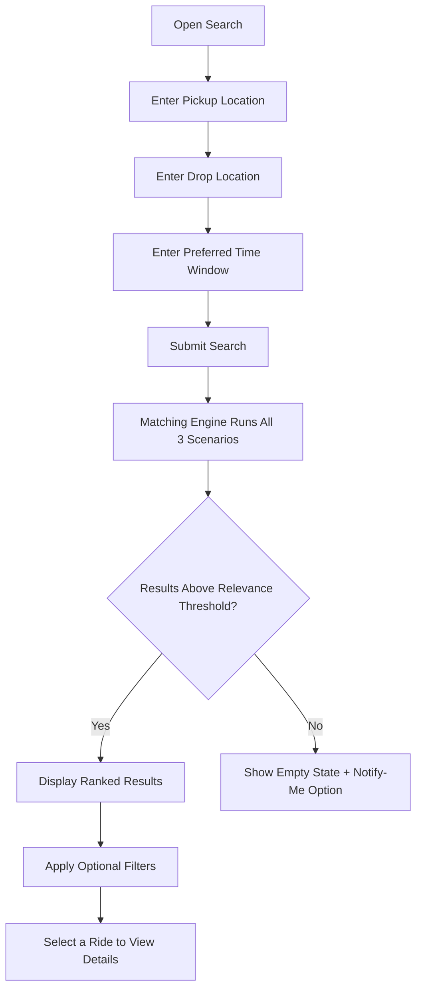

---

## Ride Match Flow (Core Matching Logic)

This flow shows the decision logic the matching engine applies for each candidate driver ride against a passenger search query.

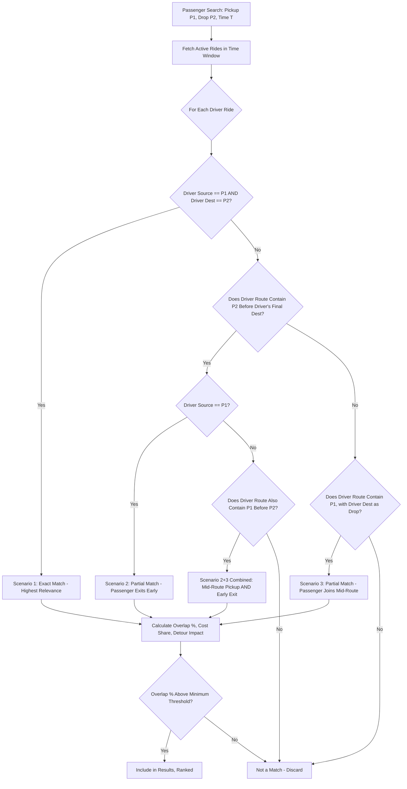

---

## Ride Join Flow

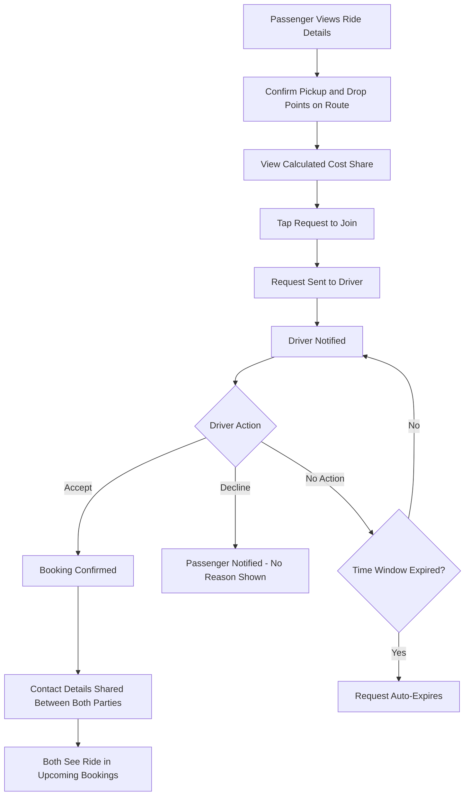

---

## Ride Completion Flow

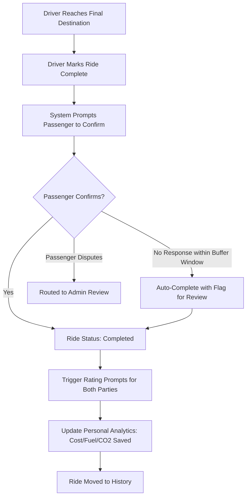

---

## Rating Flow

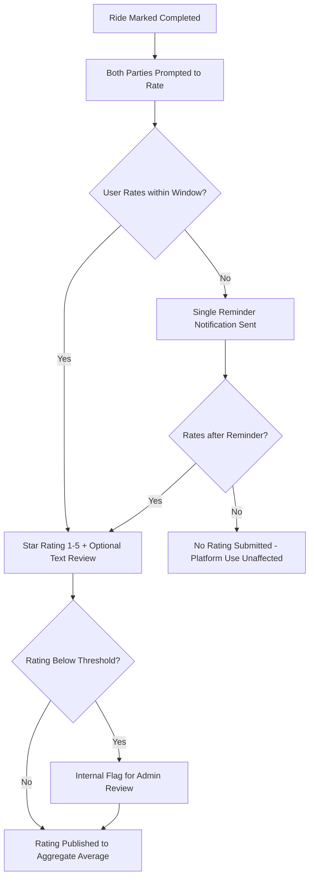

---

## Safety Flow (General)

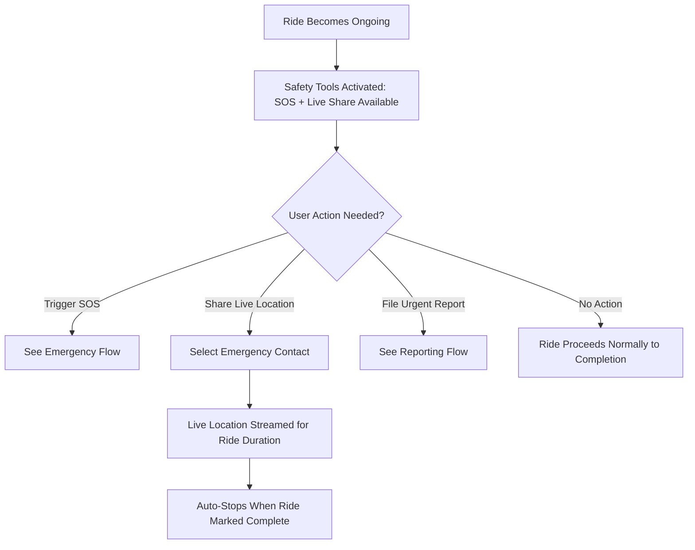

---

## Emergency Flow (SOS)

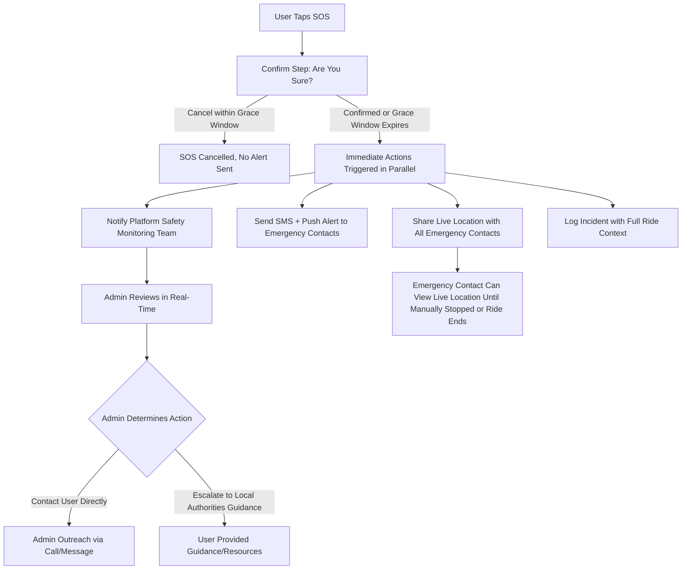

---

## Reporting Flow

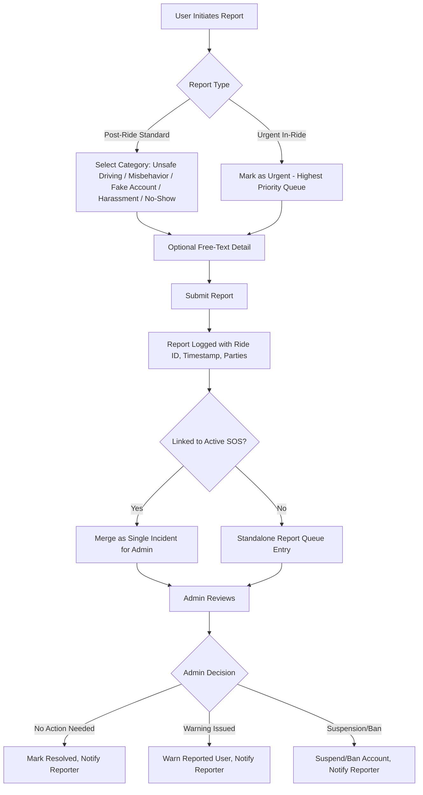

---

## Verification Flow

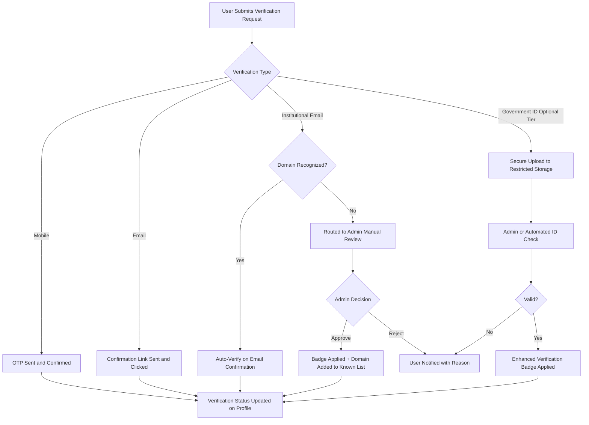

---

## Account Recovery Flow

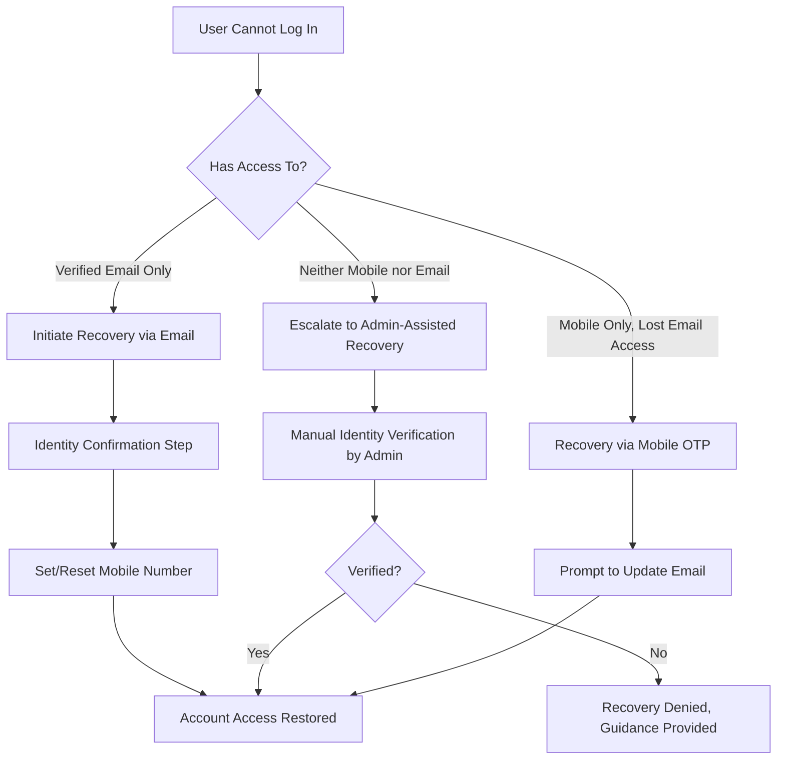

---

## State Transition Summary (Ride Lifecycle)

This is the authoritative state machine referenced by the PRD's data integrity requirements.

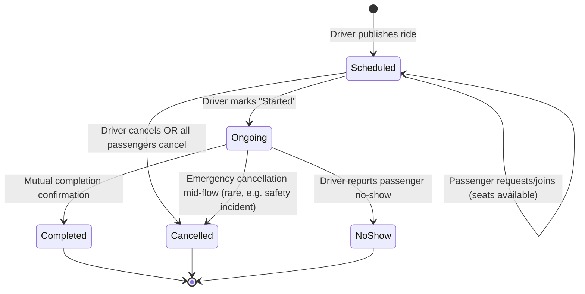

---

## Alternative and Failure Path Notes

| Flow | Alternative Path | Failure Path |
|---|---|---|
| Ride Search | Broaden time window if no exact matches | Maps/geocoding API failure → cached location fallback |
| Ride Join | Passenger browses other matches if declined | Request expires if driver doesn't respond in time |
| Ride Completion | Passenger doesn't respond → auto-complete after buffer | Passenger disputes → routed to admin review |
| SOS | User cancels within grace window | Network failure → last-known location sent, retried on reconnect |
| Verification | Domain not recognized → manual admin review | ID check fails → user notified with reason, can resubmit |
| Account Recovery | Mobile-only recovery via OTP | No access to either channel → admin-assisted manual recovery |
