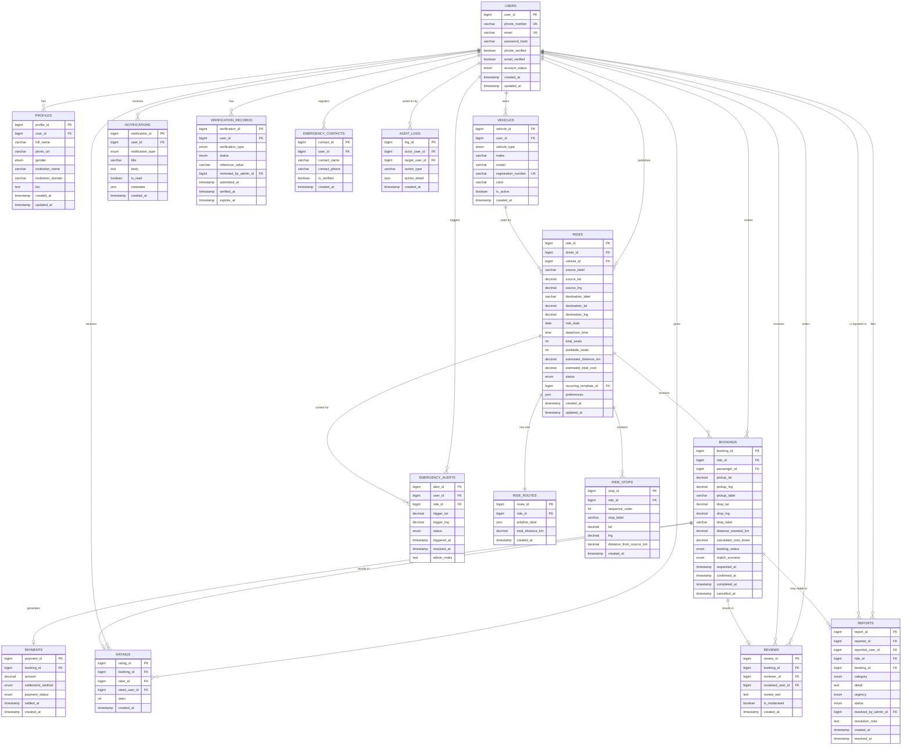

# Database Design
## Smart Community Ride Sharing Platform

---

## Database Overview

The database is designed as a relational schema (MySQL/PostgreSQL-compatible) optimized for:

- Fast route-overlap matching queries (requiring spatial/geo-aware indexing on route and stop data).
- Strict referential integrity around safety-critical data (reports, SOS events, ride logs) — these tables favor immutability and audit-friendliness over update-flexibility.
- Clean separation between identity/trust data (Users, Verification) and transactional data (Rides, Bookings) so that trust logic can evolve independently.
- Future horizontal scaling via partitioning by city/institution cluster as adoption grows beyond a single pilot cohort.

The schema below is normalized to Third Normal Form (3NF) for transactional tables, with deliberate, documented denormalization only where read performance for matching queries justifies it (noted inline).

---

## Entity Analysis

| Entity | Role in System |
|---|---|
| Users | Core identity record for every person on the platform |
| Profiles | Extended, mutable profile data separated from core auth identity |
| Vehicles | Vehicles owned/registered by users who act as drivers |
| Rides | Published ride offers created by drivers |
| RideRoutes | Geo-route data (waypoints/polyline) associated with a ride |
| RideStops | Discrete stop points along a ride's route, used for matching Scenario 2/3 |
| Bookings | A passenger's request/confirmation to join a specific ride |
| Payments | Record of calculated and (future) settled cost-share amounts |
| Reviews | Text reviews left post-ride |
| Ratings | Star ratings left post-ride |
| Reports | User-submitted reports against another user/ride |
| Notifications | Notification records sent to users |
| EmergencyAlerts | SOS event records |
| VerificationRecords | Verification status and history per user per verification type |
| AuditLogs | Immutable system-wide audit trail, including admin actions |

---

## Complete ER Diagram

---

## Relationships

| Relationship | Cardinality | Notes |
|---|---|---|
| Users → Profiles | 1:1 | Split from Users for separation of auth-critical vs. mutable profile data |
| Users → Vehicles | 1:N | A user may register multiple vehicles |
| Users → Rides | 1:N | A user (as driver) may publish many rides |
| Vehicles → Rides | 1:N | A vehicle may be used across multiple rides; a ride references exactly one vehicle |
| Rides → RideRoutes | 1:1 | Each ride has exactly one route record (geo polyline + total distance) |
| Rides → RideStops | 1:N | Ordered intermediate stops used for partial-match calculations |
| Rides → Bookings | 1:N | Multiple passengers may book against one ride, up to available seats |
| Users → Bookings | 1:N | A user (as passenger) may make many bookings over time |
| Bookings → Payments | 1:1 (optional) | Created once cost-share is calculated; settlement status tracked even though in-app payment processing is out of scope initially |
| Bookings → Ratings | 1:N (max 2 per booking — driver→passenger, passenger→driver) | Modeled as a generic ratings table rather than two separate columns for extensibility |
| Bookings → Reviews | 1:N (max 2 per booking) | Same pattern as Ratings |
| Users → Reports | 1:N as reporter, 1:N as reported | Self-referencing relationship via two foreign keys on the same table |
| Rides/Bookings → Reports | 1:N optional | A report may reference a specific ride/booking context, or stand alone (e.g., profile-level fake-account report) |
| Users → EmergencyContacts | 1:N | Minimum 1 required before ride participation (enforced at application layer, not DB constraint, since it's a workflow gate) |
| Users → VerificationRecords | 1:N | One record per verification type (mobile, email, institutional, ID), allowing historical tracking of re-verification |
| Users → AuditLogs | 1:N as actor, 1:N as target | Tracks both admin actions taken and actions taken upon a user |

---

## Constraints

- `users.phone_number` and `users.email` are UNIQUE and NOT NULL.
- `vehicles.registration_number` is UNIQUE across the platform (prevents duplicate vehicle registration across accounts).
- `bookings.ride_id + bookings.passenger_id` has a composite constraint preventing a passenger from holding more than one *active* (non-cancelled, non-completed) booking on the same ride.
- `rides.available_seats` is constrained to never exceed `rides.total_seats` and never go below 0 — enforced via application-layer transaction logic on booking confirmation/cancellation (not purely a DB CHECK constraint, since it depends on aggregating active bookings).
- `ratings.stars` CHECK constraint: value between 1 and 5 inclusive.
- `emergency_alerts.status` and `reports.status` use controlled ENUM values, not free text, to keep admin tooling and metrics reliable.
- Foreign keys on `reports.reporter_id` and `reports.reported_user_id` both reference `users.user_id`; application logic prevents `reporter_id = reported_user_id`.
- `ride_stops.sequence_order` is unique per `ride_id` (no duplicate ordering positions within a single route).

---

## Indexing Strategy

| Table | Index | Purpose |
|---|---|---|
| `rides` | Composite index on `(ride_date, status)` | Fast filtering of active, upcoming rides — the most common query pattern |
| `rides` | Spatial index on `(source_lat, source_lng)` and `(destination_lat, destination_lng)` | Enables efficient proximity queries for matching Scenario 1 |
| `ride_stops` | Spatial index on `(lat, lng)` | Enables efficient proximity queries for matching Scenario 2/3 (passenger pickup/drop along route) |
| `ride_stops` | Index on `(ride_id, sequence_order)` | Fast ordered retrieval of a ride's full stop sequence |
| `bookings` | Index on `(passenger_id, booking_status)` | Fast lookup of a user's active/past bookings |
| `bookings` | Index on `(ride_id, booking_status)` | Fast lookup of all active bookings for a given ride (used to compute available seats) |
| `reports` | Index on `(status, urgency)` | Fast admin queue prioritization |
| `notifications` | Index on `(user_id, is_read, created_at)` | Fast retrieval of a user's unread/recent notifications |
| `verification_records` | Index on `(user_id, verification_type, status)` | Fast lookup of current verification state per type |
| `emergency_alerts` | Index on `(status, triggered_at)` | Fast retrieval of active/unresolved alerts for real-time admin monitoring |

**Note on spatial indexing:** Given the matching engine's reliance on proximity queries (route-overlap, mid-route pickup/drop detection), the production database should use a spatial-index-capable engine (e.g., PostGIS extension if PostgreSQL is chosen, or MySQL's native spatial data types with SPATIAL INDEX). This is treated as a core architectural decision, not an afterthought — it directly determines whether the matching engine can scale beyond a small pilot cohort using simple linear scans.

---

## Normalization Strategy

- Core transactional tables (`Users`, `Rides`, `Bookings`, `Payments`) are normalized to 3NF to avoid update anomalies, especially important for financial (cost-share) data integrity.
- `Profiles` is deliberately split from `Users` (a 1:1 relationship that could technically be one table) to isolate authentication-critical fields from frequently-edited, less security-sensitive profile fields — this supports different caching and access-control policies per table.
- **Deliberate denormalization:** `rides.estimated_total_cost` and `rides.estimated_distance_km` are stored directly on the `Rides` table (derivable from `RideRoutes`) to avoid a join on every single search-result rendering, since ride search is the platform's highest-frequency read operation. This value is recalculated and written whenever the route is edited, keeping it consistent by design rather than by query-time computation.
- `Ratings` and `Reviews` are kept as separate tables (rather than a combined `Feedback` table) because they have different visibility rules (ratings always aggregate into a public average; review text is independently moderatable and could theoretically be hidden while the rating stands) and different cardinality/extensibility needs.

---

## Detailed Entity Specifications

### Users
**Purpose:** Core authentication and identity anchor for every account.
**Attributes:** `user_id` (PK), `phone_number` (UK), `email` (UK), `password_hash` (nullable if OTP-only auth is the primary method), `phone_verified`, `email_verified`, `account_status` (enum: active, suspended, banned, deactivated), `created_at`, `updated_at`.
**Keys:** Primary key `user_id`; unique keys on `phone_number` and `email`.
**Relationships:** Parent to nearly every other entity in the system, directly or via Bookings/Rides.

### Profiles
**Purpose:** Extended, user-editable profile information separated from core identity.
**Attributes:** `profile_id` (PK), `user_id` (FK), `full_name`, `photo_url`, `gender` (enum, optional), `institution_name`, `institution_domain`, `bio`, `created_at`, `updated_at`.
**Keys:** Primary key `profile_id`; foreign key `user_id` referencing `Users`.
**Relationships:** 1:1 with Users.

### Vehicles
**Purpose:** Vehicles registered by users acting as drivers.
**Attributes:** `vehicle_id` (PK), `user_id` (FK), `vehicle_type` (enum: two_wheeler, car), `make`, `model`, `registration_number` (UK), `color`, `is_active`, `created_at`.
**Keys:** Primary key `vehicle_id`; foreign key `user_id`; unique key `registration_number`.
**Relationships:** N:1 with Users; 1:N with Rides.

### Rides
**Purpose:** A published ride offer by a driver.
**Attributes:** `ride_id` (PK), `driver_id` (FK → Users), `vehicle_id` (FK → Vehicles), `source_label`, `source_lat`, `source_lng`, `destination_label`, `destination_lat`, `destination_lng`, `ride_date`, `departure_time`, `total_seats`, `available_seats`, `estimated_distance_km`, `estimated_total_cost`, `status` (enum: scheduled, ongoing, completed, cancelled), `recurring_template_id` (FK, nullable, self-referencing pattern for recurring ride series), `preferences` (JSON: gender_preference, no_smoking, luggage_allowed, etc.), `created_at`, `updated_at`.
**Keys:** Primary key `ride_id`; foreign keys `driver_id`, `vehicle_id`, `recurring_template_id`.
**Relationships:** N:1 with Users (driver) and Vehicles; 1:1 with RideRoutes; 1:N with RideStops and Bookings.

### RideRoutes
**Purpose:** Stores the resolved geographic route (polyline) for a ride, as returned by the Maps API.
**Attributes:** `route_id` (PK), `ride_id` (FK), `polyline_data` (JSON/encoded polyline string), `total_distance_km`, `created_at`.
**Keys:** Primary key `route_id`; foreign key `ride_id` (unique, enforcing 1:1).
**Relationships:** 1:1 with Rides.

### RideStops
**Purpose:** Discrete, ordered waypoints along a ride's route used by the matching engine to detect Scenario 2 and Scenario 3 matches.
**Attributes:** `stop_id` (PK), `ride_id` (FK), `sequence_order`, `stop_label`, `lat`, `lng`, `distance_from_source_km`, `created_at`.
**Keys:** Primary key `stop_id`; foreign key `ride_id`; unique composite on `(ride_id, sequence_order)`.
**Relationships:** N:1 with Rides.

### Bookings
**Purpose:** Represents a passenger's request to join, and eventual confirmed participation in, a specific ride.
**Attributes:** `booking_id` (PK), `ride_id` (FK), `passenger_id` (FK → Users), `pickup_lat`, `pickup_lng`, `pickup_label`, `drop_lat`, `drop_lng`, `drop_label`, `distance_traveled_km`, `calculated_cost_share`, `booking_status` (enum: pending, confirmed, declined, expired, cancelled, completed, no_show), `match_scenario` (enum: exact, partial_exit, partial_pickup), `requested_at`, `confirmed_at`, `completed_at`, `cancelled_at`.
**Keys:** Primary key `booking_id`; foreign keys `ride_id`, `passenger_id`.
**Relationships:** N:1 with Rides and Users; 1:1(optional) with Payments; 1:N with Ratings and Reviews (max 2 each); 1:N(optional) with Reports.

### Payments
**Purpose:** Tracks the calculated cost-share amount and its settlement status (off-platform in initial release, in-app in future).
**Attributes:** `payment_id` (PK), `booking_id` (FK), `amount`, `settlement_method` (enum: upi, cash, in_app [future]), `payment_status` (enum: pending, settled, disputed), `settled_at`, `created_at`.
**Keys:** Primary key `payment_id`; foreign key `booking_id` (unique, enforcing 1:1).
**Relationships:** 1:1 with Bookings.

### Reviews
**Purpose:** Optional text feedback left post-ride.
**Attributes:** `review_id` (PK), `booking_id` (FK), `reviewer_id` (FK → Users), `reviewed_user_id` (FK → Users), `review_text`, `is_moderated`, `created_at`.
**Keys:** Primary key `review_id`; foreign keys `booking_id`, `reviewer_id`, `reviewed_user_id`.
**Relationships:** N:1 with Bookings; N:1 with Users (as both reviewer and reviewed).

### Ratings
**Purpose:** Star ratings (1–5) left post-ride, the primary quantitative trust signal.
**Attributes:** `rating_id` (PK), `booking_id` (FK), `rater_id` (FK → Users), `rated_user_id` (FK → Users), `stars` (CHECK 1–5), `created_at`.
**Keys:** Primary key `rating_id`; foreign keys `booking_id`, `rater_id`, `rated_user_id`.
**Relationships:** N:1 with Bookings; N:1 with Users (as both rater and rated).

### Reports
**Purpose:** User-submitted reports of unsafe behavior, fraud, or policy violations.
**Attributes:** `report_id` (PK), `reporter_id` (FK → Users), `reported_user_id` (FK → Users), `ride_id` (FK, nullable), `booking_id` (FK, nullable), `category` (enum: unsafe_driving, misbehavior, fake_account, harassment, no_show, other), `detail`, `urgency` (enum: standard, urgent), `status` (enum: received, under_review, resolved), `resolved_by_admin_id` (FK → Users, nullable), `resolution_note`, `created_at`, `resolved_at`.
**Keys:** Primary key `report_id`; foreign keys `reporter_id`, `reported_user_id`, `ride_id`, `booking_id`, `resolved_by_admin_id`.
**Relationships:** N:1 with Users (multiple roles), optional N:1 with Rides and Bookings.

### Notifications
**Purpose:** Record of all notifications dispatched to users, supporting both delivery and an in-app notification center.
**Attributes:** `notification_id` (PK), `user_id` (FK), `notification_type` (enum), `title`, `body`, `is_read`, `metadata` (JSON, e.g., related ride_id/booking_id for deep-linking), `created_at`.
**Keys:** Primary key `notification_id`; foreign key `user_id`.
**Relationships:** N:1 with Users.

### EmergencyAlerts
**Purpose:** Immutable record of every SOS trigger event, central to the platform's safety accountability.
**Attributes:** `alert_id` (PK), `user_id` (FK), `ride_id` (FK, nullable — SOS could theoretically be platform-wide, though primary use case is ride-context), `trigger_lat`, `trigger_lng`, `status` (enum: active, resolved, false_alarm), `triggered_at`, `resolved_at`, `admin_notes`.
**Keys:** Primary key `alert_id`; foreign keys `user_id`, `ride_id`.
**Relationships:** N:1 with Users and Rides.

### EmergencyContacts
**Purpose:** A user's designated emergency contacts, mandatory before ride participation.
**Attributes:** `contact_id` (PK), `user_id` (FK), `contact_name`, `contact_phone`, `is_verified`, `created_at`.
**Keys:** Primary key `contact_id`; foreign key `user_id`.
**Relationships:** N:1 with Users.

### VerificationRecords
**Purpose:** Tracks verification status and history across all verification types (mobile, email, institutional, government ID).
**Attributes:** `verification_id` (PK), `user_id` (FK), `verification_type` (enum: mobile, email, institutional, government_id), `status` (enum: pending, verified, rejected, expired), `reference_value` (e.g., the verified email/domain), `reviewed_by_admin_id` (FK, nullable), `submitted_at`, `verified_at`, `expires_at` (nullable, used for institutional re-verification).
**Keys:** Primary key `verification_id`; foreign keys `user_id`, `reviewed_by_admin_id`.
**Relationships:** N:1 with Users.

### AuditLogs
**Purpose:** Immutable, system-wide audit trail — particularly for admin actions (suspensions, bans, report resolutions) and other security-sensitive events.
**Attributes:** `log_id` (PK), `actor_user_id` (FK, nullable for system-generated events), `target_user_id` (FK, nullable), `action_type` (e.g., "user_suspended," "report_resolved," "verification_approved"), `action_detail` (JSON), `created_at`.
**Keys:** Primary key `log_id`; foreign keys `actor_user_id`, `target_user_id`.
**Relationships:** N:1 with Users (in both actor and target roles).

---

## Data Retention & Safety-Critical Table Policy

- `EmergencyAlerts`, `Reports`, and `AuditLogs` are treated as append-only/immutable from the application layer — records are never deleted, only status-updated, to preserve a reliable safety and accountability trail.
- Ride logs (the combination of `Rides`, `Bookings`, `RideStops`, and related `RideRoutes` for a given ride) are retained for a defined minimum retention period (e.g., a configurable number of months) specifically to support delayed safety investigations or disputes, even after a ride has long been marked completed.
- Access to `EmergencyAlerts`, full `Reports` detail, and `VerificationRecords` containing government ID references is restricted at the application/role layer to admin and safety-team accounts only — not exposed via any standard user-facing API endpoint.
