# System Architecture
## Smart Community Ride Sharing Platform

---

## Design Philosophy

This architecture is designed under one guiding constraint: **the matching engine and the safety-critical path (SOS/emergency) are the two components most likely to need independent scaling, independent reliability guarantees, and independent evolution** — and the architecture isolates them accordingly from the start, rather than treating the system as a single monolithic CRUD application that gets split apart later under pressure.

Everything else (auth, profiles, bookings, notifications, admin) follows a more conventional service-oriented structure, but is still built with clear service boundaries so it can scale horizontally as cohort density and user count grow from a single-campus pilot toward a multi-city platform.

---

## High-Level Architecture

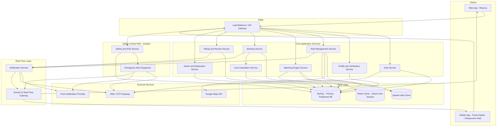

---

## Component Breakdown

### Auth Service
Handles registration, OTP issuance/verification, JWT issuance and refresh, session/device management, and account recovery. Designed as the first point of contact for every client request requiring identity, and kept stateless (token-based) to support horizontal scaling.

### Profile and Verification Service
Manages profile CRUD, vehicle registration, and the verification workflow (mobile, email, institutional, government ID). Institutional domain checking and the admin manual-review queue for verification edge cases live here.

### Ride Management Service
Owns the lifecycle of a `Ride` entity: creation, editing, recurring-ride template generation, cancellation, and state transitions (Scheduled → Ongoing → Completed). Delegates route resolution to the Maps API and writes resolved route/stop data used by the Matching Engine.

### Matching Engine Service
The computational core of the platform. Given a passenger search query (pickup, drop, time window), it queries the spatial index for candidate rides, evaluates all three matching scenarios, computes route-overlap percentage and detour impact, and returns ranked results. This service is deliberately separated from Ride Management so it can be scaled, cached, and eventually swapped for a more sophisticated (e.g., ML-based) implementation without touching ride CRUD logic.

### Booking Service
Manages the request → accept/decline → confirm → complete lifecycle of a `Booking`, enforcing business rules (seat availability, no self-booking, no duplicate active bookings on the same ride) and orchestrating calls to the Cost Calculation Service.

### Cost Calculation Service
A narrowly-scoped, stateless calculation service: given a ride's total distance/cost and a passenger's pickup/drop points, it returns the passenger's distance-proportional cost share. Kept separate so its logic (currently simple, potentially evolving toward "Dynamic Cost Optimization" per the roadmap) can change independently of booking workflow logic.

### Rating and Review Service
Handles post-completion rating/review submission, aggregate rating computation, and moderation flagging for low ratings or flagged review text.

### Admin and Moderation Service
Backs the admin dashboard: report queue management, user suspension/ban actions, verification edge-case resolution, and platform safety metrics aggregation. Has elevated, audited access to otherwise-restricted data (e.g., full report detail, government ID verification records).

### Safety and SOS Service (Isolated)
Deliberately isolated from the rest of Core Services. Owns SOS trigger handling, live-location-sharing session management during active rides, and urgent in-ride reporting. Designed with the narrowest possible dependency surface so that a failure or slowdown elsewhere in the system (e.g., the Matching Engine under heavy load) cannot degrade SOS responsiveness.

### Emergency Alert Dispatcher
A dedicated, high-priority fan-out component triggered by the Safety Service: simultaneously notifies emergency contacts (SMS + push), alerts the admin/safety monitoring team, and pushes a real-time update via the Socket.IO gateway — all in parallel, not sequentially, to minimize time-to-alert.

### Notification Service
Handles all non-emergency notification dispatch (ride reminders, booking status changes, rating prompts), with delivery via push notification provider and SMS fallback for critical-but-non-emergency events.

### Socket.IO Real-Time Gateway
Provides real-time, bidirectional updates to clients: live ride status changes, live location updates during an active ride, and instant SOS-related UI state changes — without requiring clients to poll.

---

## Service Responsibilities Summary Table

| Service | Primary Responsibility | Scales Independently Because |
|---|---|---|
| Auth | Identity and session management | High request volume (every authenticated call), stateless by design |
| Profile/Verification | User and vehicle data, trust badges | Lower frequency, higher data sensitivity — different access control needs |
| Ride Management | Ride CRUD and lifecycle | Write-moderate, read-heavy via search |
| Matching Engine | Route-overlap computation | Most compute-intensive operation in the system; needs caching and spatial indexing tuned independently |
| Booking | Booking lifecycle and business rules | Transactional integrity critical; needs strong consistency guarantees |
| Cost Calculation | Distance-proportional cost-share math | Stateless, narrowly scoped, easiest to evolve/replace independently |
| Rating/Review | Post-ride feedback | Asynchronous, can tolerate slight processing delay unlike booking/safety paths |
| Admin/Moderation | Internal operations tooling | Low request volume, elevated access control, different deployment/security posture |
| Safety/SOS | Emergency response | Highest reliability and lowest latency requirement in the entire system — isolated for failure-domain separation |
| Notification | Non-emergency alerts | High volume, can tolerate retry/eventual delivery unlike safety alerts |

---

## User Journey Mapping (Cross-Service View)

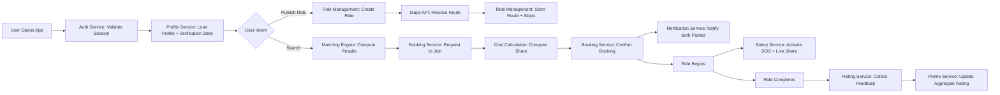

---

## Authentication Flow (Sequence Diagram)

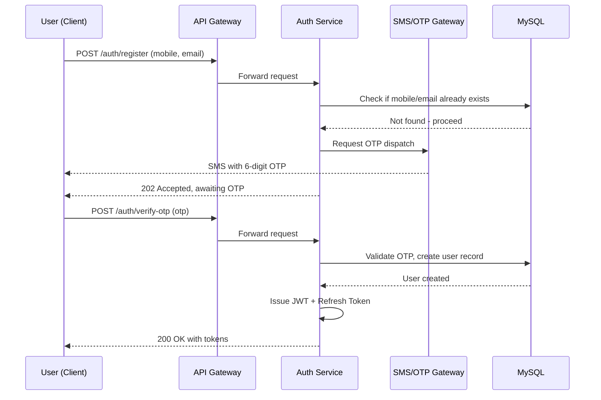

---

## Ride Matching Flow (Sequence Diagram)

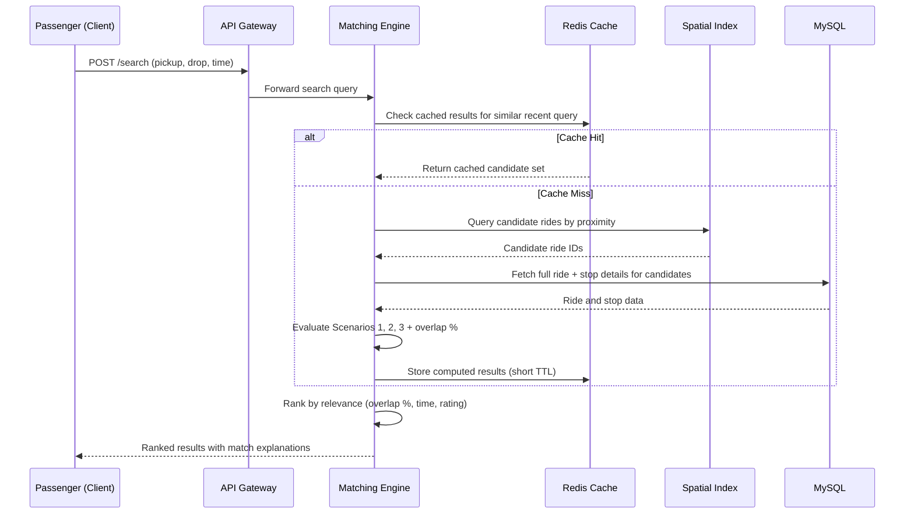

---

## Notification Flow (Sequence Diagram)

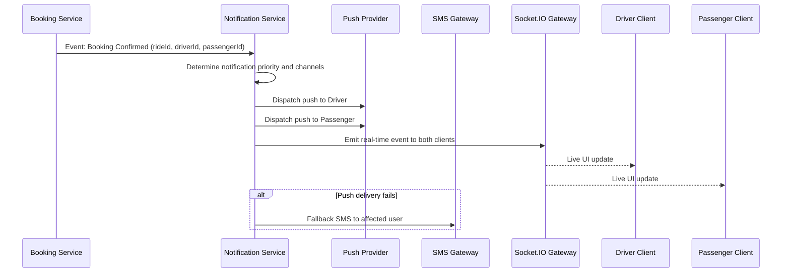

---

## Emergency Flow (Sequence Diagram) — Highest Priority Path

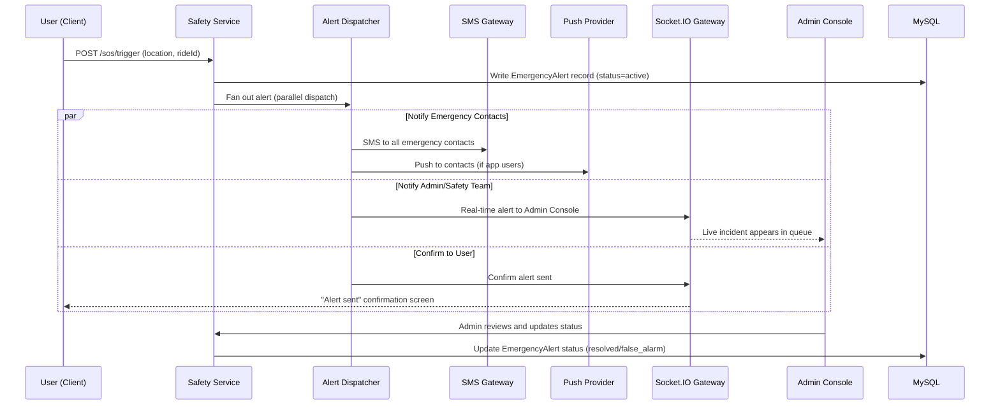

---

## Reporting Flow (Sequence Diagram)

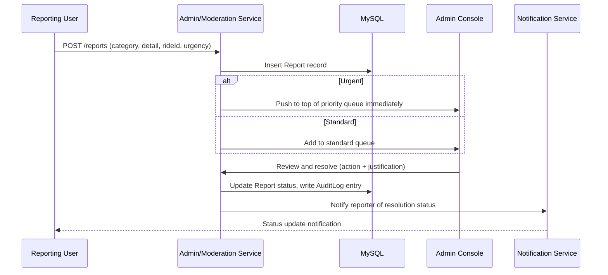

---

## Analytics Flow (Sequence Diagram)

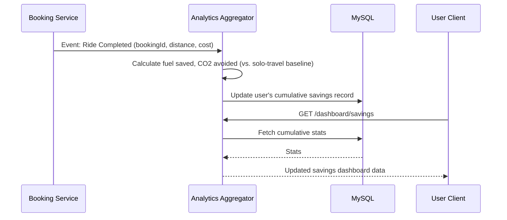

---

## Component Diagram (Logical Grouping)

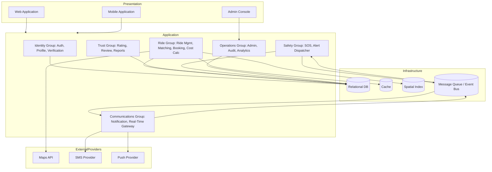

---

## Data Flow Diagram — Ride Lifecycle

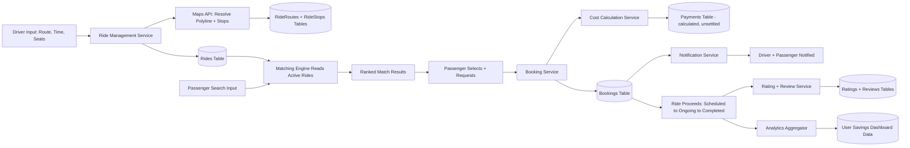

---

## Event Flow Diagram — Event-Driven Backbone

For cross-service communication that doesn't need synchronous request/response (notifications, analytics updates, audit logging), the architecture uses an event bus pattern so that, for example, the Safety Service never has to wait on the Notification Service to complete its own critical path.

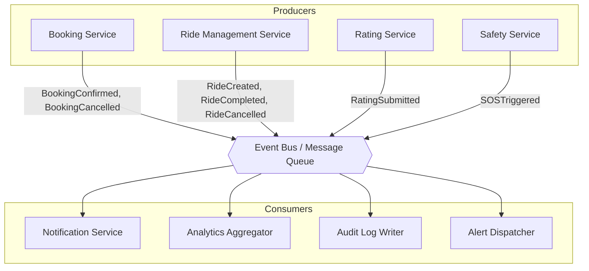

**Note:** `SOSTriggered` events are published to the bus for downstream consumers like Audit and Analytics, but the actual emergency dispatch (SMS/push to emergency contacts) happens via the Safety Service's direct, synchronous call path to the Alert Dispatcher — not via the asynchronous bus — to guarantee the lowest possible latency for the single most safety-critical action in the system. The event bus publication is for record-keeping and secondary consumers only.

---

## Scalability Considerations

- **Matching Engine** is the primary horizontal-scaling target: stateless, cacheable, and the most compute-intensive service. It can be scaled out independently behind the API Gateway as cohort density and search volume grow.
- **Database partitioning** by city or institution cluster is planned once the platform expands beyond a single-cohort pilot, since route-matching queries are naturally scoped to a geographic area and rarely need to span partitions.
- **Read replicas** for the relational database support the read-heavy nature of ride search without contending with write-heavy booking/safety transactions on the primary.
- **Caching layer (Redis)** absorbs repeated identical/near-identical search queries (e.g., many students searching the same campus-to-hostel route around the same time), reducing load on the spatial index and primary database during peak commute windows.

## Security Considerations

- All inter-service communication occurs over an internal network with TLS, even though all are part of the same trusted backend, to maintain defense-in-depth.
- The Safety/SOS Service and Admin/Moderation Service have stricter access control boundaries than other services, given the sensitivity of the data they touch (live location, government ID, report details).
- JWT validation occurs at the API Gateway layer before requests reach individual services, reducing duplicated auth logic across services.
- Rate limiting is applied at the Gateway level, with stricter limits on Auth Service endpoints (OTP requests, login attempts) to prevent abuse.

## Reliability Considerations

- The Safety/SOS path is architected with the fewest possible dependencies and the most aggressive failure-handling (e.g., last-known-location fallback on connectivity loss) since it cannot tolerate the same degree of eventual-consistency or retry-later behavior acceptable elsewhere in the system.
- Non-critical services (Notification, Analytics) are designed to degrade gracefully — a delay or temporary failure in these does not block the core ride/booking transaction path.
- Database writes for safety-critical tables (`EmergencyAlerts`, `Reports`, `AuditLogs`) use synchronous, confirmed writes rather than relying solely on eventual-consistency patterns used elsewhere.

## Performance Considerations

- Spatial indexing on route and stop data is treated as a first-class architectural requirement (not an optimization to add later), since linear-scan matching against all active rides would not meet the sub-2-second search latency target as ride volume grows.
- Search result caching uses a short TTL appropriate to how frequently ride availability changes, balancing freshness against load reduction.

## Maintainability Considerations

- Clear service boundaries (Matching Engine separate from Ride Management; Cost Calculation separate from Booking) are maintained specifically so that algorithmic components likely to evolve — particularly matching logic moving toward the roadmap's "AI Route Matching" and cost logic moving toward "Dynamic Cost Optimization" — can be replaced or upgraded without requiring changes to the surrounding transactional services.

## Future Expansion Considerations

- The event-bus backbone is designed to support additional future consumers (e.g., an institutional analytics dashboard consumer, a future ML training-data pipeline consumer) without requiring changes to the producer services.
- The architecture's service boundaries map cleanly onto a future native mobile app, since all client-facing functionality is already exposed via the same API Gateway used by the web application — no web-specific business logic is embedded outside the gateway/service layer.
